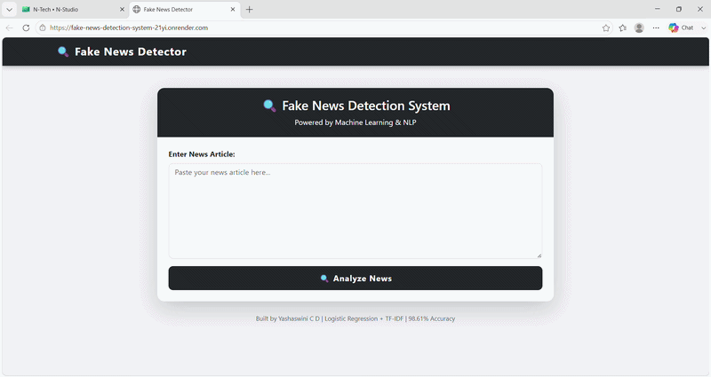
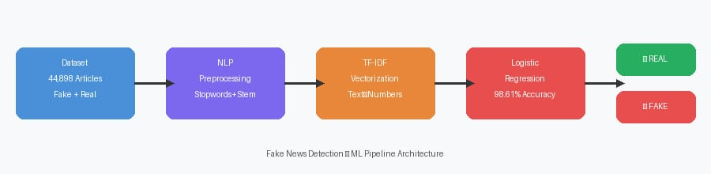
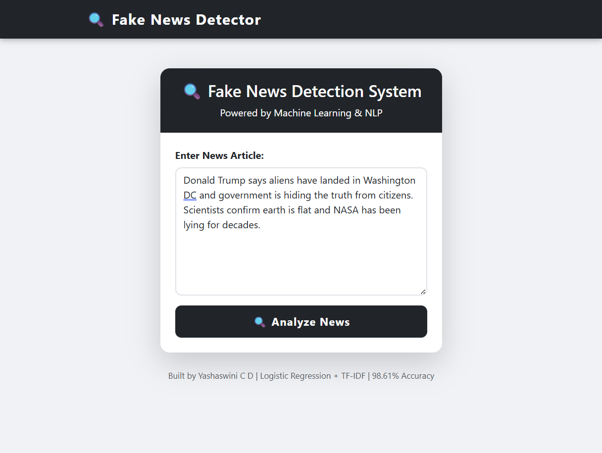
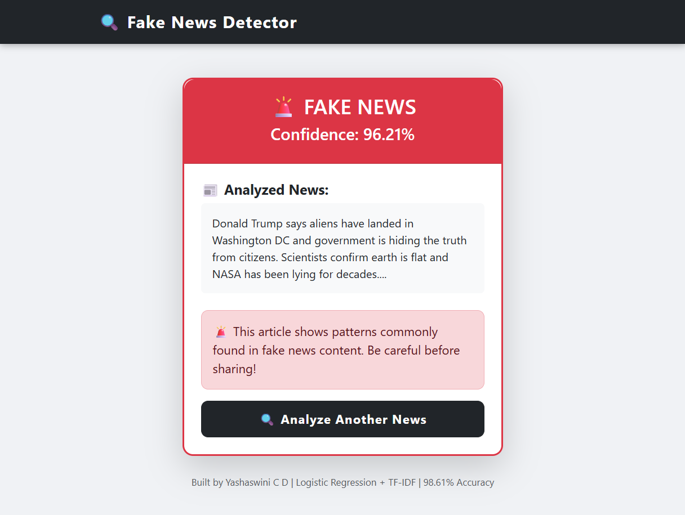
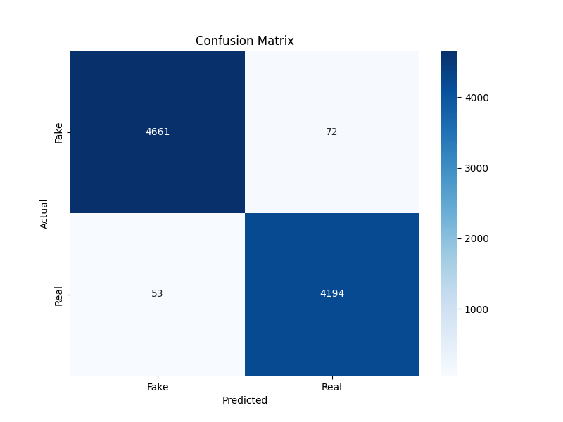
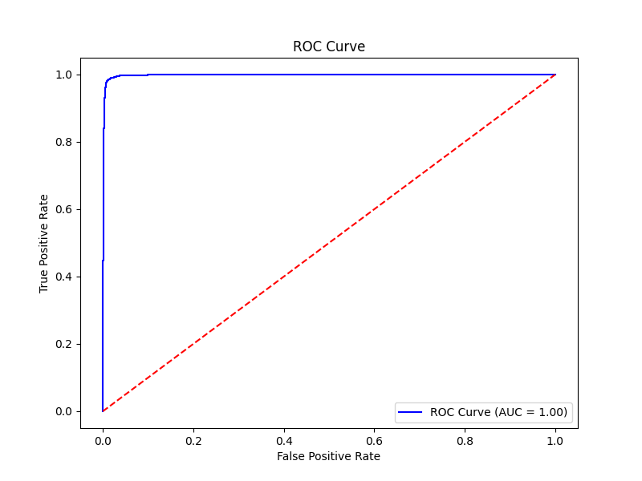

# 🔍 Fake News Detection System


---

## 🌐 Live Demo
👉 **[Click here to try the app](https://fake-news-detection-system-21yi.onrender.com)**
📄 **[Project Page](https://yashaswinicd.github.io/fake-news-detection-system)**
🎥 **[Watch Demo on YouTube](https://youtu.be/Ci_ZUK16QH0)**

---

## 🎬 Demo





---

## 📌 Project Overview
A Machine Learning web app that detects whether a news article is **Real or Fake** using NLP and Logistic Regression — achieving **98.61% accuracy** on 44,898 articles.

---

## ✨ Features
- ✅ 98.61% Accuracy
- ✅ AUC Score: 0.9981
- ✅ Real-time prediction with confidence score
- ✅ REST API endpoint (`/api/predict`)
- ✅ CI/CD with GitHub Actions
- ✅ Docker support
- ✅ Beautiful web UI

---

## 🛠️ Tech Stack
| Layer | Technology |
|-------|-----------|
| Language | Python 3.8+ |
| ML | Scikit-learn, NLTK |
| Vectorization | TF-IDF |
| Algorithm | Logistic Regression |
| Backend | Flask |
| Frontend | Bootstrap 5 |
| Deployment | Render + Docker |

---

## 📊 Model Results
| Metric | Value |
|--------|-------|
| Accuracy | 98.61% |
| Precision | 98.7% |
| Recall | 98.6% |
| F1 Score | 98.6% |
| ROC AUC | 0.9981 |

---

## 🏗️ Architecture





---

## 📸 Screenshots

### Home Page





### Prediction Result





### Model Performance








---

## ⚙️ How It Works
1. 📝 User pastes a news article into the web app
2. 🧹 Text is cleaned — lowercase, remove special characters
3. 🔤 NLTK removes stopwords and applies stemming
4. 📐 TF-IDF Vectorizer converts text to numbers
5. 🧠 Logistic Regression model predicts Real or Fake
6. 📊 Confidence score is displayed to the user

---

## 🚀 Installation

```bash
git clone https://github.com/yashaswinicd/fake-news-detection-system.git
cd fake-news-detection-system
pip install -r requirements.txt
python train.py
python app.py
```

---

## 🐳 Docker Support

```bash
docker build -t fake-news-detection .
docker run -p 5000:5000 fake-news-detection
```
Then visit: `http://localhost:5000`

---

## 🔌 REST API

**Endpoint:** `POST /api/predict`

```bash
curl -X POST http://localhost:5000/api/predict \
  -H "Content-Type: application/json" \
  -d "{\"text\": \"Your news article here\"}"
```

**Response:**
```json
{
  "result": "FAKE NEWS",
  "confidence": "93.27%",
  "emoji": "🚨"
}
```

**Health Check:** `GET /health`
```json
{"status": "ok", "model": "loaded"}
```

---

## 📁 Project Structure

```
fake-news-detection-system/
├── .github/workflows/
│   └── test.yml
├── data/raw/
├── models/
│   ├── fake_news_model.pkl
│   └── vectorizer.pkl
├── notebooks/
├── screenshots/
├── static/
├── templates/
├── tests/
│   └── test_prediction.py
├── utils/
├── app.py
├── train.py
├── predict.py
├── Dockerfile
└── requirements.txt
```

---

## 📊 Dataset
- Source: Kaggle
- Fake news: 23,481 articles
- Real news: 21,417 articles
- Total: 44,898 articles

---

## ⚠️ Known Limitations
- Works only on English news articles
- Free hosting may have 50 second cold start delay

---

## 🔮 Future Improvements
- 🤖 BERT/RoBERTa for better accuracy
- 🌐 Multilingual support (Hindi, Kannada)
- 🔍 Explainable AI using SHAP/LIME
- 📱 Mobile app integration

---

## 👩‍💻 Built By
**Yashaswini C D** | CSE Student | Aspiring AI/ML Engineer

---

## 🗺️ Roadmap

### ✅ Completed
- [x] Logistic Regression model — 98.61% accuracy
- [x] Flask web app with confidence score
- [x] Deployed on Render
- [x] GitHub Pages project site
- [x] CI/CD with GitHub Actions
- [x] REST API endpoint
- [x] Docker support
- [x] Demo GIF + YouTube video

### 🔮 Upcoming
- [ ] BERT/RoBERTa model for better accuracy
- [ ] Multilingual support (Hindi, Kannada)
- [ ] Explainable AI using SHAP/LIME
- [ ] Mobile app integration
- [ ] Browser extension

---
## 💻 System Requirements
- Python 3.8+ | RAM: 4GB minimum
- OS: Windows / Linux / macOS

---

## ❓ FAQ

**Q: What types of news can this detect?**
A: English language news articles and headlines.

**Q: Can I use my own dataset?**
A: Yes! Replace CSV files in `data/raw/` and retrain using `train.py`.

**Q: Why is the app slow sometimes?**
A: Free Render hosting has ~50 second cold start delay.

---

## 📚 References
- [Kaggle Dataset](https://www.kaggle.com/clmentbisaillon/fake-and-real-news-dataset)
- [Scikit-learn Docs](https://scikit-learn.org/stable/)
- [Flask Docs](https://flask.palletsprojects.com/)
- [NLTK Docs](https://www.nltk.org/)

---

## 🙏 Acknowledgements
- Dataset by **Clément Bisaillon** on Kaggle
- Built at **Akshaya Institute of Technology, Tumakuru**

---

## 📋 Version History
| Version | Date | Changes |
|---------|------|---------|
| v1.0.0 | June 2026 | Initial release — 98.61% accuracy, Flask, CI/CD, REST API, Docker |